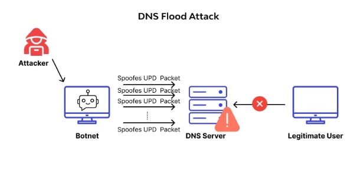

DNS Saldırıları Nelerdir?

Nasıl Yapılır ?

DNS Nedir (Domain Name System);

DNS özetlemek gerekirse IP adreslerinin internet sistemindeki isim olarak yansımasıdır.
İnternet ortamında genel olarak IP adresleri iletişim sağlanır. İnternette gezinmenin Kolay olması amacıyla DNS geliştirilmiştir. 

**DNS Çalışma Mantığı;**

Bir Alan adı (Domain) arattığınızda tarayıcılar ilk olarak DNS sunucusuna gider DNS sunucusu ise kendi veritabanında IP adresinin karşılık alan, Alan adını (Domain) adresini bulur ve tarayıcıda erişmek istediğiniz web siteye erişmiş olursunuz.

**DNS kullanmanın avantajları;**

Bir Alan adının IP adresini değiştirmek istediğinizde sadece DNS sunucusundan gerekli isteği değiştirmeniz yeterli olucaktır. Aynı alan adını kullanarak farklı IP adresini kullanmış olacaksınız.

**En yayın olarak kullanılan DNS kayıtları;**

A (Address) Kaydı : Bir web sitenin IP adresini belirtir.
CNAME (Canonical Name) Kaydı: Bir alan adını başka bir alan adına yönlendirir. Bir alan adının birden fazla alan adı üzerinden erişimini sağlar.
MX (Mail Exchanger) Kaydı: Bir alan adının e-posta sunucusunu belirtir. E-postalar bu kayıtta belirtilen sunucuya yönlenir.
NS (Name Server) Kaydı: Bir alan adının hangi DNS sunucularına sahip olduğunu belirtir ve alan adını arattığınızda bu Name Server (isim sunucusu) Alan adının bu DNS sunucularından geçtiğini anlayabilirsiniz.**

Başlıca DNS Saldırıları

DNS zehirleme (DNS Spoofing);

DNS yanıtlarını değiştirerek domain adresinin yanlış IP adresine erişmesini sağlar ve bu sayede kullanıcının trafiğini kontrol eder.

**DNS İsteklerinin Yönlendirilmesi (DNS Hijacking);**

DNS isteklerini çalar ve dilediği başka bir sunucuya yönlendirir . Bu şekilde kullanıcını doğru hedefe yönlendirmeyeceği için ulaşmasını engelleyebilir veya isteklerini izleyebilir.

**DNS Amplifikasyon Saldırısı;**

Bir tür DdoS saldırısıdır. Sahte IP adresleri kullanarak farklı büyük boyutlarda DNS istekleri gönderir ve DNS yanıtlarının saldıracağı hedef sunucuya yönlendirir . Bu sayede hedef sunucu fazla yük altında kalıcağı için internet ağında kesintiler meydana gelebilir.

**DNS Flood Saldırısı;**

Belirlenen DNS sunucusuna yoğun miktarda DNS isteği gönderir bu sayede DNS sunucusunun kaynaklarını tüketir ve hizmet kesintisine neden olur.

